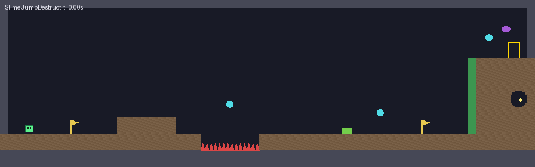

# SlimeJumpDestruct

[SlimeJump](../SlimeJump) with ground you can dig and enemies that burst. It uses `src/terrain` and `src/destruction` the way a game would, and it is a regression test for both.



*The bot's run, drawn from the simulation's own state (the game has no renderer in this sample). The pit in the floor and the pocket in the tower are craters; the green pieces are what is left of the worm.*

## What is different from SlimeJump

| | SlimeJump | SlimeJumpDestruct |
|---|---|---|
| Walls | physics boxes | the floor, ceiling and outer walls stay boxes (bedrock); the platforms and the tower are one `TerrainLayer`, a 512 x 96 pixel bitmap at 8 pixels to the unit, with smooth chain colliders |
| Player bullets | vanish on a wall | dig a crater (10 pixels across) where they hit the terrain |
| A dead enemy | switched off | switched off, and a stand-in body of its size is shattered by `Destruction2D` (Voronoi, 3 extra points) into pieces that fall and pile up; a pit (2 units across) is dug where it stood |
| Respawn | enemies, gems and bullets reset | the same, and the pieces are cleared; craters stay |
| Layers | | new layer `Debris` (11): the pieces collide with the walls and the terrain, and with nothing else |

Everything else (player, lasso, bot, traps, enemy AI, level) is SlimeJump's. `Level.cs` is its copy plus `WallDiggable` (which walls are terrain) and the debris row of the layer matrix.

## The files that are new

| File | |
|---|---|
| `Ground.cs` | the terrain: building it from the level, `Dig`, and `Overlap` / `Ray`, the queries described below |
| `Debris.cs` | shattering a dead enemy |
| `Game.cs`, `Enemy.cs`, `Shared.cs` | the hooks: build the terrain, dig where a bullet lands, shatter on death, clear the pieces on respawn |
| `Player.cs`, `Bot.cs`, `Lasso.cs`, `Traps.cs` | each wall probe now asks `Ground` instead of the physics world |

## Why `Ground` has its own queries

A terrain shape belongs to no collider (its collider index is -1), so the physics world's `OverlapBox` and `Raycast` do not report it. SlimeJump senses everything with those two (grounded, wall ahead, line of sight, bullets, the lasso), so on a terrain they would see through every wall. `Ground.Overlap` and `Ground.Ray` ask the physics world (bedrock, the climbable wall) and the bitmap, and answer with the nearer; the ray marches half a pixel at a time and bisects the last step, and takes the surface normal from the pixels around the hit. The bitmap is also what the collision shapes are built from, so the two agree. The physical collisions (the slime standing on the ground, the pieces landing) are Box2D's own, on the terrain's shapes.

This is a limitation of the engine's queries, not of this sample; a game that uses terrain and queries needs something like `Ground`.

## Run it

```
python3 build.py dotnet samples/SlimeJumpDestruct                    # .NET: the reference
python3 build.py player samples/SlimeJumpDestruct --verify --run     # translated to C, and compared with .NET
python3 build.py test SlimeJumpDestruct                              # with the other samples
```

## What it prints

```
terrain built=1 pixels=12224 shapes=16
pocket: solid before=1 after=0 ray hit terrain=1 distance*1000=1000 normal x*1000=-1000
...
won=1 frame=531 deaths=0 gems=0 enemies=2 slain=2 crumbled=0
terrain: craters=3 chunks rebuilt=3 pixels dug=358 shapes=17
debris: enemies shattered=2 pieces=14 pieces still there=14
scene problems=0
all checks passed
```

Before the run it digs a pocket deep in the tower, away from the route, and checks that the ground is gone and that a ray from inside hits the wall a unit away; then it fires a bullet in the pocket, which must dig the wall it hits. At the end it checks that both enemies shattered into pieces and that the scene is consistent (`scene.Validate()`). The exit code is 0 only if the bot won and every check passed. The bot reaches the goal as in SlimeJump, but jumps the pit the worm leaves, so it picks up one gem fewer.

## Checked, and not

Run on Mono against the real Box2D shim (with `[LibraryImport]` swapped for `DllImport`): the bot wins at frame 531, every check passes, and two runs print the same bytes. Not yet run: the .NET build as the repo builds it, and the translation to C (`--verify`). Run `build.py test SlimeJumpDestruct` before relying on it.

The pool limits matter here: 256 nodes, 128 rigidbodies and 256 colliders (`CoreLimits.cs`) are shared by the level, the bullets and the pieces. A shatter that does not fit makes as many pieces as it can.
