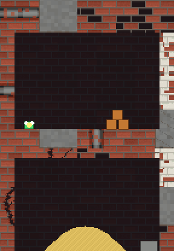

# SlimeJumpDestructSand

SlimeJumpDestruct turned sideways: the slime goes **down a shaft** (18 x 96 units, seven rooms) instead of scrolling right, and the shaft is full of things that break and things that flow.

The shaft is an old building falling apart. In the picture the walls are brick in 4-unit tiles of different kinds: plain brick, brick painted white and peeling, cracked brick, brick with bricks missing, bare concrete, and brick with an exposed pipe; behind the rooms is the same brick, dim. This is only how the picture is drawn (the terrain is still rock, sand and water pixels); it is drawn from the run's own state (the terrain bitmap and the colliders), not by the engine's renderer: the picture was recorded from the Prowl2D version of this game (`tools/sand_gif.py` there); the two play the same level.

- **Terrain**: one `TerrainLayer` with `EnableSand()`. Rock, sand and water are pixels of the same bitmap; stone and sand are ground, water is not.
- **Crates and boulders** (`Destruct.cs`): a boulder shatters with Destruction2D into rock fragments, digs a crater and sprinkles sand rubble; a crate digs a bigger crater, blasts, and sets off its neighbours.
- **Bullets dig**: a shot that hits rock or sand carves a hole, and the sand around it runs in.
- **Rooms**: 0 crates over the floor; 1 a sand dune that pours into any hole; 2 a pool in a basin that drains into room 3; 3 boulders and crates; 4 a sealed **sand silo**; 5 a sealed **water tank**; 6 the vault, with a **teleporter** that sends the slime back to the top (the shaft stays as it was left: the holes, the rubble and the sand are still there for the next trip down). Shoot a silo's plug and the contents run out and down.
- **Bot** (`Bot.cs`): drives the slime, so the headless run plays the whole level.

Run it: `python3 build.py player samples/SlimeJumpDestructSand --run` (also `--verify` for .NET vs C, and `--sanitize`).
The run prints per-room "sand/water" grain counts as the slime enters each room, every explosion, and ends with `won=1`.

Stride2D's physics queries do not see terrain (its shapes carry no collider id), so `Destruct.Overlap` and `Destruct.RayHits` stand in for `OverlapBox` and `Raycast`: they ask the physics world and then the terrain's pixels. The slime, the bot and the bullets sense walls with them.
