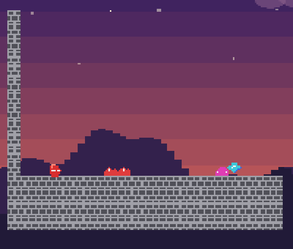

# SlimeJumpRust

*The bot playing the level in about 14 seconds: it shoots the worm, dodges the turret's arrows, climbs the vines and swings across the gap on the lasso.*

[SlimeJump](../SlimeJump) with its game logic in **Rust** — the Crust subset, lowered to C by `shivyc/crust.py` and linked into the engine library; no rustc, no C++ compiler.
The level, sprites and scripts are an editor project (`stride2d_editor/slime_rust.py`, an 84 × 16 level with a red slime and a dusk backdrop, `stride2d_editor/scenery.py`):

    python3 stride2d.py --demo slime-rust      # open it; press F5 (Build) in the Scripts window, then play in the viewport

Controls: arrows or A/D walk, space / up / W jump (let go early for a short hop; keep it held to climb vines), **left mouse button** shoots the blaster at the pointer,
**right mouse button** throws the lasso (it catches on walls and anchors; W / S reel in and out, A / D pump the swing, letting go of the button lets go of the rope), **T** switches the bot on and off.

The level, from the left: spikes and a worm, a pit, a checkpoint, crumbly platforms over a pit, a turret that shoots arrows along the ground, a wall to climb by its vines,
a plateau with a second checkpoint, a gap too wide to jump with an anchor above it, and the goal flag. Gems are kept once you reach a checkpoint after picking them up, and come back if you die first.

| script | what it does |
|---|---|
| `Slime.rs` | the player: input (or the bot's), walking, variable jump, climbing, the blaster, the lasso and its rope, respawn at the last checkpoint. It makes its own body (`add_body_ex`: dynamic, no rotation) and finds the ground with a probe (`overlap_box`) |
| `Bullet.rs`, `Arrow.rs` | nodes the Slime and the Turret make while playing (`new_node`, `attach_script`): they fly straight, are stopped by walls, and shoot a worm / hurt the slime |
| `Turret.rs` | a solid block that shoots an arrow toward the slime every second while it is within twelve units |
| `Worm.rs`, `Spikes.rs` | hurt; a worm is squashed from above or shot |
| `Crumbly.rs` | a solid platform that dissolves a second after the slime stood on it (it moves out of the level, and is back when the slime dies) |
| `Vine.rs`, `Anchor.rs` | a trigger on layer 15 that the slime's probe finds to climb; a solid block the lasso can catch (tag 7) |
| `Save.rs`, `Gem.rs`, `Goal.rs` | the checkpoint flag, the gems, the flag at the end (its tag becomes 99) |
| `Bot.rs` | a *game script* (it runs once, on a node of the game itself): plays the level through the same numbers a player gives, looking with probes at walls, gaps, vines, spikes, worms, arrows and anchors |

The scripts talk through **node tags** (`set_tag` / `get_tag`, with `node_slots` to scan the nodes: 1 slime, 2 worm, 4 arrow, 6 bullet, 7 anchor, 8 goal, 9 spikes) and through a store of
numbers (`set_global` / `get_global`: deaths, checkpoint, gems, the bot's inputs ... see the constants at the top of `Slime.rs`). That takes the place of the C# sample's shared static class:
scripts in another language have no shared state, only the engine's calls. A script that makes nodes gives them a script with `attach_script(node, SCRIPT_BULLET)` (every script has a constant
`SCRIPT_<NAME>` made from its file name).

The tests (`stride2d_editor/test_engine.py`, `SlimeJumpInRust`) build the scripts with the editor's own Build and play them: walking and jumping, spikes, pit and worms, gems and checkpoints,
climbing, the blaster, the lasso, turret arrows, crumbly platforms, and the bot playing the whole level to the goal.
